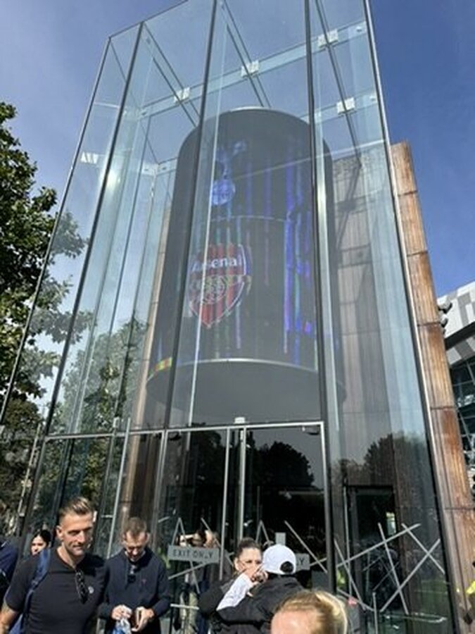
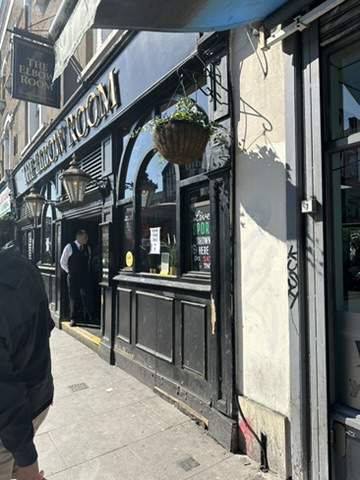
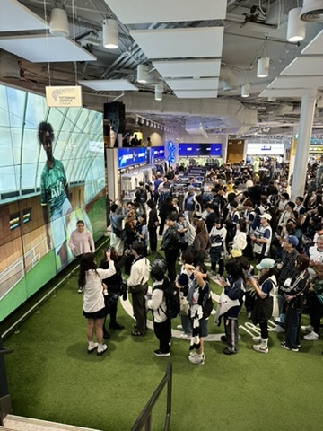
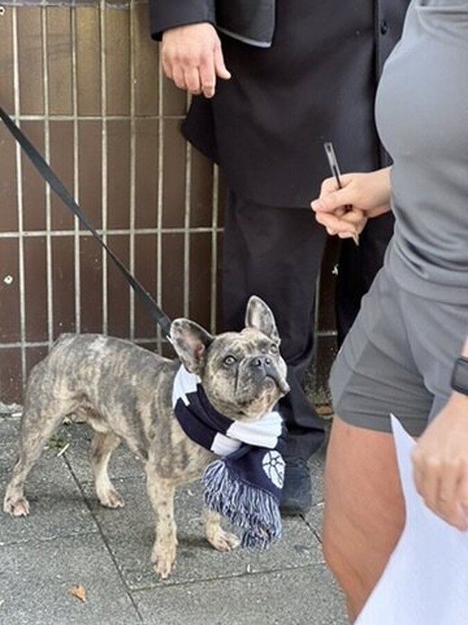
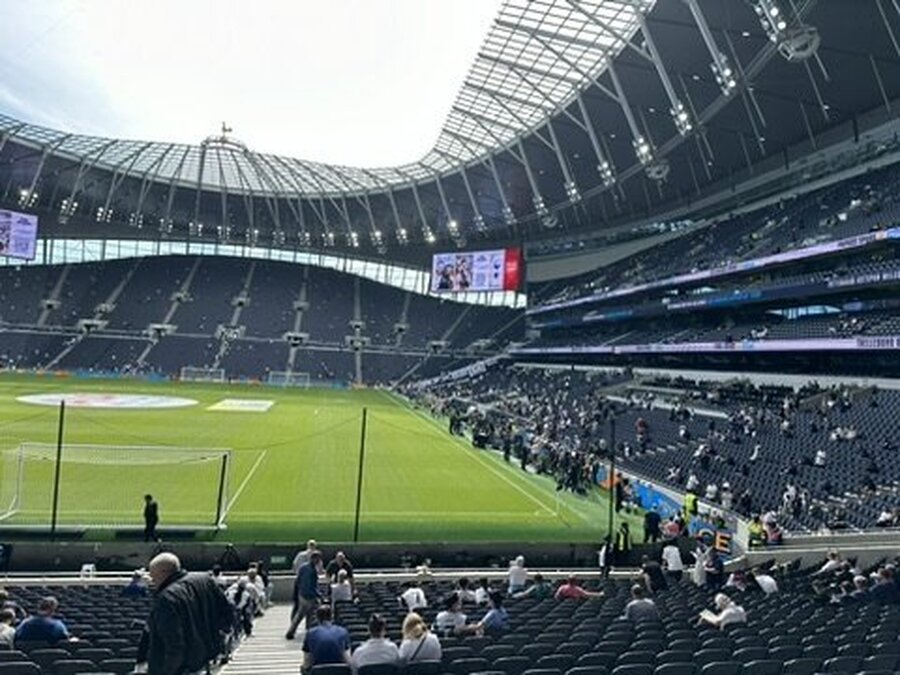
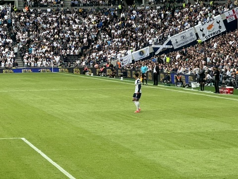
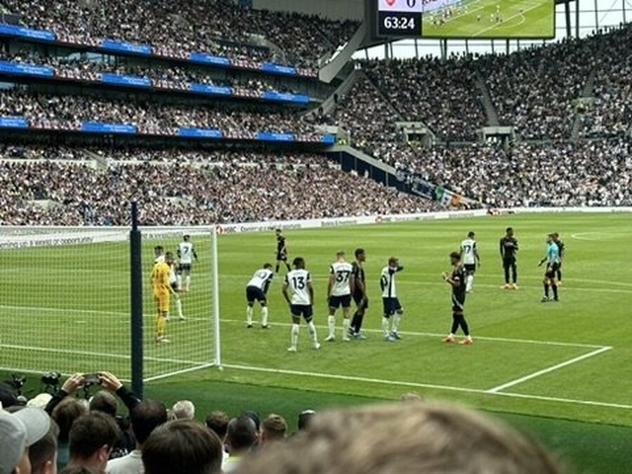
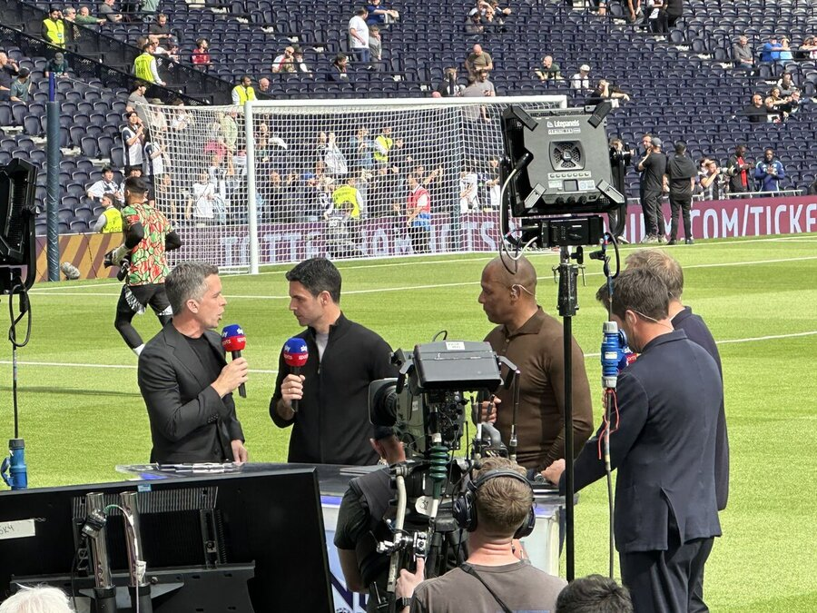
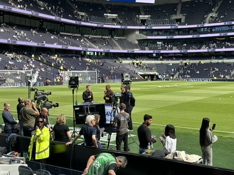

런던에 도착하고 며칠째 되던 날, 이날은 아침부터 시작이 조금 특별했다. 그냥 여행 일정 중 하루가 아니라, 그 유명한 **북런던 더비**를 직접 보러 가는 날이라 그랬나 보다. 아침부터 괜히 들뜨고 설레는 기분이 멈추질 않았다.

사실 이 경기 티켓 구하는 과정부터가 고난이었다. 이번 여행을 꽤 급하게 준비하다 보니 미리 티켓 체크를 못 했고, 뒤늦게 알아보니 공식 티켓은 이미 다 빠진 상태더라. 급하게 토트넘 멤버십도 가입해보고 남은 자리를 계속 찾아봤지만 결국 실패...

결국 [이피엘 티켓](https://www.eplticket.com/)에서 남은 좌석을 구매하게 됐다. 가격은 솔직히 생각보다 많이 비쌌다. 하지만 이 경기를 런던에서 직접 본다는 생각에 '그냥 내 인생의 특별한 경험에 투자하자'고 마음먹었다. **돈은 다시 벌면 되지만, 이 순간은 지금뿐이니까.**

경기장 근처로 가면서부터 공기부터 달라지는 게 느껴졌다. 흰 유니폼 입은 사람들이 점점 많아지더니 자연스럽게 발걸음이 그쪽으로 모인다. 경기장 주변 건물마다 이미 분위기가 달궈져 있었다.

토트넘 홋스퍼 스타디움 주변은 경기 시작 전인데도 이미 작은 축제 같았다. 중간에 들른 펍에서는 다들 경기 얘기뿐이고, 모르는 사람끼리도 한마디씩 주고받으면서 금방 같은 팀을 응원하는 분위기가 된다. 이게 바로 런던에서 축구 보는 진짜 재미구나 싶더라.

밖으로 나오니까 토트넘 머플러를 두르고 있는 강아지도 만났는데, 그 귀여운 한 장면이 이날의 분위기를 다 설명해 주는 느낌이었다.

경기장 안으로 들어가는 순간은 생각보다 더 인상적이었다. 사진으로 정말 많이 봤던 곳인데도 실제로 보니까 훨씬 크고 깔끔했다. 무엇보다 사람들로 가득 찬 그 압도적인 열기가 확 다가온다.

자리가 꽤 가까운 편이라 선수들이 워밍업 하는 모습도 잘 보였다. 그중에서도 **손흥민 선수**는 확실히 눈에 들어오더라. 직접 보니까 확실히 다르다. 속도나 움직임, 공간을 쓰는 방식 같은 게 TV로 볼 때보다 훨씬 생생하게 느껴져서 '왜 세계적인 선수인지'를 조금은 이해하게 된 순간이었다.

경기가 시작되고 나서는 분위기가 완전히 바뀌었다. 응원 소리, 함성, 긴장감까지 전부 섞이면서 나도 그 열기 안에 같이 들어가 있는 느낌이 든다. 북런던 더비라는 게 괜히 유명한 게 아니었다. 경기 내내 팽팽한 흐름이 이어지고, 작은 장면 하나에도 반응이 크게 터진다.

내가 앉았던 자리는 **Short-side Lower, 골대 뒤쪽 하단 구역에서 5번째 줄** 정도였다. 가까운 자리라 그런지 선수들의 움직임이나 경기 속도감은 정말 생생하게 느껴지더라. 특히 공이 박스 근처로 올 때 긴장감이 확 올라오는데, 이건 TV로 볼 때랑은 차원이 다른 느낌이다.

다만 반대편에서 벌어지는 플레이는 거의 보이지 않는 수준이라 경기 전체 흐름을 한눈에 보기에는 조금 아쉬운 자리긴 했다. 그리고 그 위치 덕분에(?) 결정적인 장면을 바로 눈앞에서 보게 됐다.

코너킥 상황에서 올라온 공이 그대로 연결되면서 가브리엘 마갈량이스의 헤더 골이 들어갔고, 그 장면이 정말 바로 앞에서 펼쳐졌다. 너무 가까워서 오히려 현실감이 더 강하게 느껴졌던 순간... 하지만 응원하는 입장에서는 그게 결승골이 되어버려서 더 진한 아쉬움으로 남는다.

<video controls style="width:100%; max-width:720px; border-radius:8px;">
  <source src="goal_scene.MOV" type="video/mp4">
</video>

그래도 이런 거리에서 골 장면을 직접 본다는 건 쉽게 할 수 있는 경험은 아니기에, 지금 생각해보면 그것도 하나의 큰 기억으로 남을 것 같다. 결과는 아쉽게도 토트넘의 패배였지만, 경기 끝나고 나오는 길에 느껴지는 그 아쉬운 공기까지도 이 경험의 일부라는 생각이 들었다.

경기 전 중계 준비하는 모습도 바로 앞에서 보고, TV에서 보던 장면을 실제로 보는 소소한 재미까지...

단순히 유명한 장소만 훑고 지나가는 게 아니라, 이 도시 사람들이 진짜 좋아하는 걸 같이 경험해 본 기분이라 참 좋았다. 런던에서의 이 하루는 아마 오래도록 기억에 남을 것 같다.

### ✅ 여행자를 위한 소소한 팁

**1. 토트넘 멤버십 가입은 필수!**
이번에 저처럼 티켓 구하기 힘들지 않으려면 미리 멤버십에 가입하는 게 좋아요.
* **공식 사이트:** [One Hotspur Membership](https://www.tottenhamhotspur.com/tickets/buy-tickets/one-hotspur-membership/)
* **Tip:** 북런던 더비 같은 빅매치는 'One Hotspur+' 등급이어야 예매 확률이 훨씬 높아져요.

**2. 좌석 선택 시 참고**
* 골대 뒤 하단은 생동감은 최고지만, 반대편 경기가 잘 안 보인다는 점은 꼭 감안하세요.

**3. 런던 펍 분위기 즐기기**
* 경기 시작 2~3시간 전에는 근처 펍에 가서 현지 팬들의 열기를 꼭 느껴보세요. 그게 진짜 직관의 시작이니까요!
